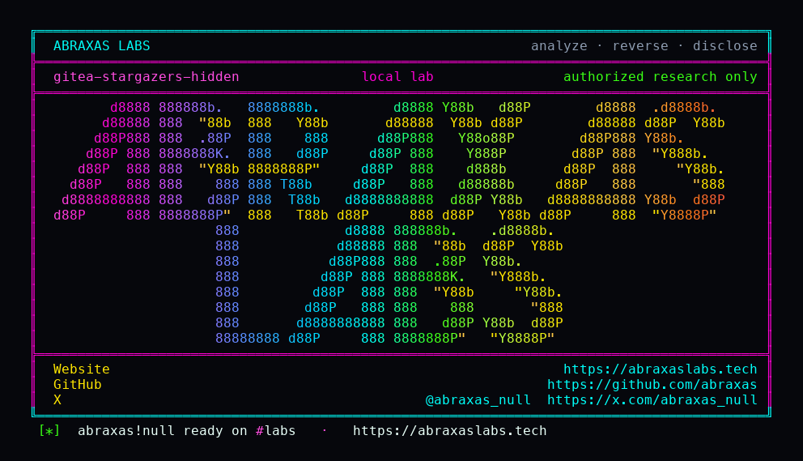

<p align="center">
  
</p>

<p align="center">
  <a href="https://abraxaslabs.tech"><strong>abraxaslabs.tech</strong></a>
  &nbsp;·&nbsp;
  <a href="https://github.com/abraxas">github.com/abraxas</a>
  &nbsp;·&nbsp;
  <a href="https://x.com/abraxas_null">@abraxas_null</a>
  &nbsp;·&nbsp;
  <a href="https://github.com/abraxas/gitea-stargazers-hidden">gitea-stargazers-hidden</a>
</p>

# gitea-stargazers-hidden

**Gitea** `1.27.3` — Gitea

Unpublished Gitea source finding: unauth stargazers/watchers leak limited usernames.

| | |
|---|---|
| ID | Unpublished Gitea source finding #5 (no CVE yet) |
| CWE | [CWE-200](https://cwe.mitre.org/data/definitions/200.html) |
| CVSS | **Medium: 5.3** `CVSS:3.1/AV:N/AC:L/PR:N/UI:N/S:U/C:L/I:N/A:N` |
| Product | [Gitea](https://github.com/go-gitea/gitea) |
| Affected | all versions **through 1.27.3** (inclusive) |
| Patched | vendor patch — see references |
| Auth | unauthenticated (see source map) |
| License | [GNU Affero GPL v3.0](LICENSE) |
| Lab | `127.0.0.1` only · vendor/client disclosure pack, not a scanner |

---

## Advisory (from the source map)

GetStargazers / GetWatchers omit isUserVisibleToViewerCond. Follower lists already apply the visibility condition.

---

## Entry

- **Method:** `GET`
- **Path:** `/api/v1/repos/{owner}/{repo}/stargazers`
- **Router:** Unauthenticated GET. GetStargazers / GetWatchers omit isUserVisibleToViewerCond. GET /users/{name} 404s limited users. Follower lists already filter.
- **Notes:** Unauthenticated unpublished Gitea #5 CWE-200 v1.27.3. Witness: unauth stargazers JSON includes hidstar while unauth GET  is 404. Not eval. Not a reverse shell.

### Call chain

- `limited user stars + watches public repo`
- `unauth GET /api/v1/users/hidstar → 404`
- `unauth GET /api/v1/repos/{owner}/{repo}/stargazers includes hidstar`
- `unauth GET .../subscribers includes hidstar; followers web omits`

### Lab preconditions

- Gitea 1.27.3
- Public repository
- At least one limited/hidden user who starred or watched it

### Witness

unauth stargazers JSON includes hidstar; unauth GET  is 404

### Not success

- eval/base64/system payload
- reverse shell
- unauth GET  returning 200
- followers web HTML listing hidstar

---

## Patch / remediation

**Do this first:** Apply the vendor patch for **Gitea**. See references.

**Verify after upgrade**

- Re-run `gitea-stargazers-hidden-Abraxas-Labs.py` against the patched build: the mapped witness must **not** appear.
- Confirm the vendor advisory / changeset in the deployed tree (see references).
- A WAF signature is delay, not a patch.

**If you cannot update immediately**

- Disable or isolate the affected component.
- Hunt for the witness condition on production (new privileged users, unexpected files, injected rows — whatever this CVE's map names).

---

## Reproduction (authorized lab)

Target **only** `http://127.0.0.1:8088` (or the loopback you bound). Do not point this script at the internet.

```bash
python3 gitea-stargazers-hidden-Abraxas-Labs.py
```

Success is the **witness** above in the response body. Generic 200 HTML is not it.

---

## Lab images

Loopback stack used to reproduce. Official images unless a `Dockerfile` in this folder builds from source.

- [`lab/docker-compose.yml`](lab/docker-compose.yml)
- [`lab/Dockerfile`](lab/Dockerfile)
- [`lab/run.sh`](lab/run.sh)

```bash
cd lab
docker compose up --force-recreate
```

Bind the vulnerable product tree next to Compose if the YAML mounts a local directory (plugin zip / source tag from the version table). Publish nothing except `127.0.0.1`.

---

## References

- [github.com/go-gitea/gitea](https://github.com/go-gitea/gitea) tag v1.27.3

- Abraxas Labs: [abraxaslabs.tech](https://abraxaslabs.tech) · [github.com/abraxas](https://github.com/abraxas) · [@abraxas_null](https://x.com/abraxas_null)

---

## Records (structured)

```
# Gitea unpublished #5 — stargazers leak hidden users

CWE: CWE-200
Severity: Medium (source review)

## Description

Unauthenticated `GET /repos/{owner}/{repo}/stargazers` and watchers omit `isUserVisibleToViewerCond`. A limited user who starred a public repo appears in those lists while `GET /users/{name}` is 404. Follower lists already filter.

## Product

Gitea 1.27.3. Lab oracle is the limited login in unauth JSON, not a shell.
```

---

## License

This disclosure pack is licensed under the **GNU Affero General Public License v3.0**. See [LICENSE](LICENSE).

---

## Disclaimer

This pack is for **the vendor, the site owner, and licensed labs**. The script talks to `127.0.0.1`. Using it against systems you do not own is not authorized by Abraxas Labs. No warranty.

<p align="center">
  <a href="https://abraxaslabs.tech">abraxaslabs.tech</a> ·
  <a href="https://github.com/abraxas">github.com/abraxas</a> ·
  <a href="https://x.com/abraxas_null">@abraxas_null</a>
</p>
